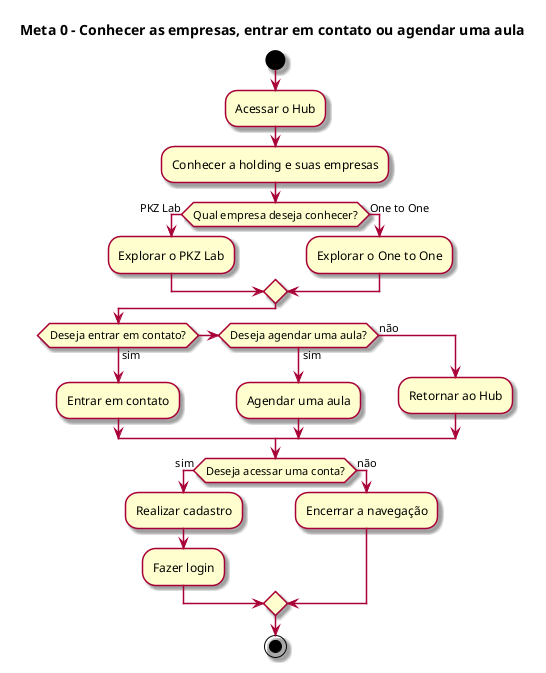
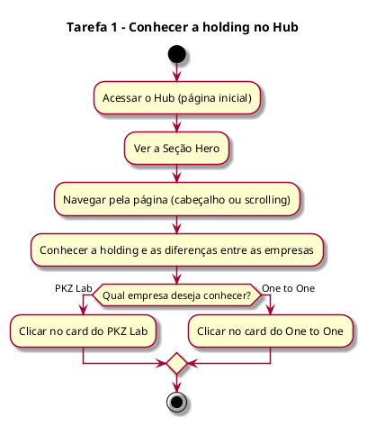

# Análise Hierárquica de Tarefas (AHT) – Hub

## 1. Introdução

Esta AHT descreve as tarefas dos usuários no portal institucional da Holding Esportiva (PKZ Lab e One to One).

Este documento é a parte da AHT dedicada ao Hub e reúne também as seções gerais: usuários, meta principal (Meta 0) e conclusão. As demais tarefas estão nos documentos do PKZ Lab (Tarefa 2), do One to One (Tarefa 3), de Contato e Agendamento (Tarefas 4 e 5) e de Login e Cadastro (Tarefas 6 e 7).

Escopo do projeto:

- Somente front-end, com React e Vite (seção 6.1).
- Necessidades que exijam back-end, banco de dados ou autenticação real não serão atendidas no projeto (seção 6.1).
- A página de agendamento de aula faz parte da plataforma (seções 1.2 e 5.1). Na Tarefa 5 é desenvolvida a interface; a verificação real dos horários disponíveis, o registro do agendamento e a consulta dos agendamentos dependem de back-end (seção 6.1).
- As telas de cadastro e login fazem parte da plataforma (seções 4 e 4.1) e devem respeitar as limitações técnicas do projeto (seção 4.2). Por isso, nas Tarefas 6 e 7 é desenvolvida a interface; o funcionamento depende de back-end.
- Áreas restritas com login e autenticação estão fora do escopo (seção 1.2).

Notação:

- 0 = meta principal.
- 1, 2, 3 = tarefas; 1.1, 1.2 = subtarefas.
- Plano = ordem e condições em que o usuário realiza as subtarefas.
- Cada plano é acompanhado do seu diagrama de atividade, escrito em PlantUML.

## 2. Usuários (seção 3.2)

- Visitantes: acessam o site para conhecer as empresas, visualizar seus conteúdos ou encontrar informações de contato.
- Clientes potenciais: ainda não têm relação com as empresas; usam o Hub para identificar qual empresa atende melhor aos seus interesses e depois entrar em contato.
- Atletas Jovens: interessados em treinamento, desenvolvimento esportivo e melhoria de desempenho; acessam principalmente a página do PKZ Lab.
- Atletas Adultos: buscam treinamento personalizado, condicionamento físico ou melhoria de desempenho; conhecem principalmente a proposta do One to One.
- Pais e responsáveis: buscam informações sobre treinamento e desenvolvimento físico para crianças ou adolescentes antes de realizar um contato.

## 3. Hierarquia geral

Meta 0: Conhecer as empresas, entender suas propostas e buscar informações para decidir se deseja entrar em contato (seção 3.2) ou agendar uma aula (seções 1.2 e 5.1).

- 1 – Conhecer a holding no Hub
- 2 – Explorar o PKZ Lab
- 3 – Explorar o One to One
- 4 – Entrar em contato
- 5 – Agendar uma aula
- 6 – Realizar cadastro
- 7 – Fazer login

Plano 0: O usuário começa pelo Hub (Tarefa 1). Depois escolhe qual empresa quer conhecer: PKZ Lab (Tarefa 2) ou One to One (Tarefa 3), podendo voltar ao Hub a qualquer momento. Se quiser falar com a empresa, entra em contato (Tarefa 4). Se quiser marcar uma aula, faz o agendamento (Tarefa 5). Se quiser acessar uma conta, faz o cadastro (Tarefa 6), caso ainda não tenha, e depois o login (Tarefa 7).

Diagrama de atividade do Plano 0:

## 4. Tarefas

### Tarefa 1 – Conhecer a holding no Hub

- 1.1 Acessar o Hub (página inicial)
- 1.2 Ver a Seção Hero (frase de impacto, elementos visuais e botão de ação principal)
- 1.3 Conhecer a holding, sua proposta de atuação e as relações e diferenças entre PKZ Lab e One to One
- 1.4 Navegar pela página (cabeçalho ou scrolling)
- 1.5 Escolher a empresa pelos cards ou ícones direcionadores

Plano 1: O usuário entra no Hub e vê a Seção Hero. Em seguida, navega pela página, pelo cabeçalho ou rolando a tela, para conhecer a holding e suas empresas. Por fim, clica no card da empresa que quer conhecer, indo para a Tarefa 2 ou 3.

Diagrama de atividade do Plano 1:

## 5. Rastreabilidade: tarefas × requisitos (seção 5.1)

- Tarefa 1: Apresentação da Holding; Navegação entre as Empresas; Chamadas para Ação.

## 6. Conclusão

A AHT mostra que a meta principal do usuário é conhecer as empresas da holding e decidir se deseja entrar em contato ou agendar uma aula. O caminho principal é: Hub, escolha da empresa (PKZ Lab ou One to One) e, em seguida, contato (pelo formulário ou pelos canais oficiais) ou agendamento de uma aula. As páginas das empresas permitem retornar ao Hub, e os CTAs levam o usuário ao contato, ao agendamento, ao cadastro ou ao login.

As Tarefas 1 a 4 formam o núcleo do portal (Hub, landing pages e contato) e são desenvolvidas por completo no front-end. A Tarefa 5 é desenvolvida como página de agendamento, pois a verificação real dos horários e o registro dos agendamentos exigem back-end. As Tarefas 6 e 7 são desenvolvidas como telas, pois o funcionamento do cadastro e do login exige back-end e autenticação real, que não serão atendidos no projeto (seções 1.2 e 6.1).
