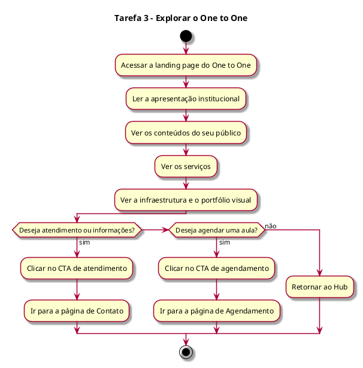

# Análise Hierárquica de Tarefas (AHT) – One to One

## 1. Introdução

Este documento faz parte da AHT do portal institucional da Holding Esportiva (PKZ Lab e One to One) e descreve a tarefa de explorar a landing page do One to One (Tarefa 3). A numeração das tarefas segue a AHT completa; a meta principal (Meta 0), os usuários e a conclusão geral estão no documento do Hub.

Escopo do projeto:

- Somente front-end, com React e Vite (seção 6.1).

Notação:

- 0 = meta principal.
- 1, 2, 3 = tarefas; 1.1, 1.2 = subtarefas.
- Plano = ordem e condições em que o usuário realiza as subtarefas.
- Cada plano é acompanhado do seu diagrama de atividade, escrito em PlantUML.

## 2. Tarefas

### Tarefa 3 – Explorar o One to One

- 3.1 Acessar a landing page do One to One a partir do Hub
- 3.2 Ler a apresentação institucional
- 3.3 Ver os conteúdos direcionados ao seu público (atletas e não atletas)
- 3.4 Ver os serviços (treinamento personalizado, condicionamento físico e acompanhamento individual)
- 3.5 Ver a infraestrutura e o portfólio visual (imagens e vídeos)
- 3.6 Clicar no CTA de atendimento e informações, no CTA de agendamento ou retornar ao Hub

Plano 3: O usuário entra na página do One to One e lê a apresentação. Depois vê o conteúdo para o seu público, os serviços, a infraestrutura e o portfólio, na ordem que quiser. No fim, clica no botão de atendimento (vai para a Tarefa 4), no botão de agendamento (vai para a Tarefa 5) ou volta ao Hub (Tarefa 1).

Diagrama de atividade do Plano 3:

## 3. Rastreabilidade: tarefas × requisitos (seção 5.1)

- Tarefa 3: Página Institucional do One to One; Navegação entre as Empresas; Conteúdo Visual; Chamadas para Ação.
