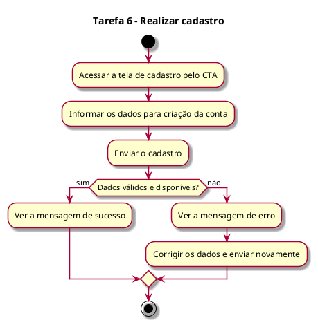
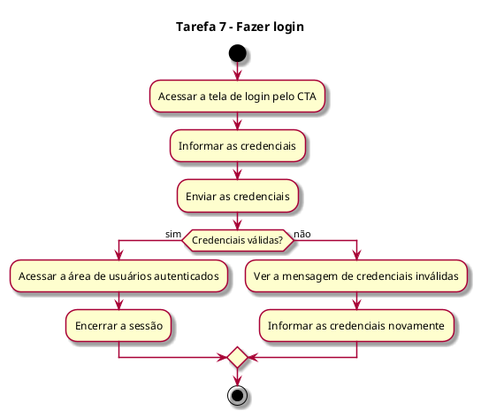

# Análise Hierárquica de Tarefas (AHT) – Login e Cadastro

## 1. Introdução

Este documento faz parte da AHT do portal institucional da Holding Esportiva (PKZ Lab e One to One) e descreve as tarefas de realizar cadastro (Tarefa 6) e fazer login (Tarefa 7). A numeração das tarefas segue a AHT completa; a meta principal (Meta 0), os usuários e a conclusão geral estão no documento do Hub.

Escopo do projeto:

- Somente front-end, com React e Vite (seção 6.1).
- Necessidades que exijam back-end, banco de dados ou autenticação real não serão atendidas no projeto (seção 6.1).
- As telas de cadastro e login fazem parte da plataforma (seções 4 e 4.1) e devem respeitar as limitações técnicas do projeto (seção 4.2). Por isso, nas Tarefas 6 e 7 é desenvolvida a interface; o funcionamento depende de back-end.
- Áreas restritas com login e autenticação estão fora do escopo (seção 1.2).

Notação:

- 0 = meta principal.
- 1, 2, 3 = tarefas; 1.1, 1.2 = subtarefas.
- Plano = ordem e condições em que o usuário realiza as subtarefas.
- Cada plano é acompanhado do seu diagrama de atividade, escrito em PlantUML.

## 2. Tarefas

### Tarefa 6 – Realizar cadastro

- 6.1 Acessar a tela de cadastro pelo CTA
- 6.2 Informar os dados para criação da conta
- 6.3 Enviar o cadastro
- 6.4 Corrigir os dados obrigatórios, se inválidos
- 6.5 Informar outros dados, se já estiverem vinculados a outro usuário (quando aplicável)
- 6.6 Ver a mensagem de sucesso

Plano 6: O usuário abre a tela de cadastro, preenche seus dados e envia. Se algum dado estiver errado ou já estiver em uso por outro usuário, ele corrige e envia de novo. Quando o cadastro dá certo, vê a mensagem de sucesso.

Diagrama de atividade do Plano 6:

### Tarefa 7 – Fazer login

- 7.1 Acessar a tela de login pelo CTA
- 7.2 Informar as credenciais
- 7.3 Enviar as credenciais
- 7.4 Ver a mensagem de credenciais inválidas, se houver
- 7.5 Acessar a área de usuários autenticados
- 7.6 Encerrar a sessão

Plano 7: O usuário abre a tela de login, informa suas credenciais e envia. Se estiverem erradas, vê a mensagem de erro e tenta de novo. Se estiverem certas, acessa a área de usuários autenticados e, ao terminar, encerra a sessão.

Diagrama de atividade do Plano 7:

Observação sobre as Tarefas 6 e 7: são desenvolvidas as telas. A criação da conta, a validação dos dados e das credenciais, a sessão e a área restrita exigem back-end e autenticação real, que não serão atendidos no projeto (seções 1.2 e 6.1).

## 3. Rastreabilidade: tarefas × requisitos (seção 5.1)

- Tarefa 6: Cadastro de Usuário (somente a tela); Chamadas para Ação.
- Tarefa 7: Login e Acesso (somente a tela); Chamadas para Ação.
