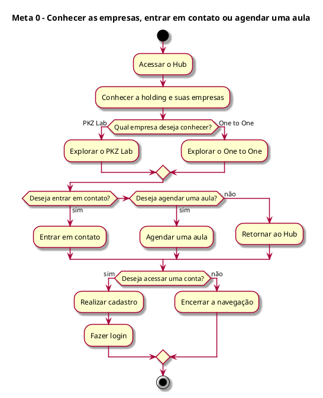
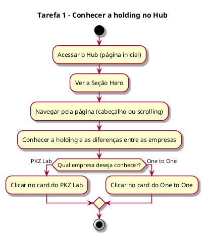
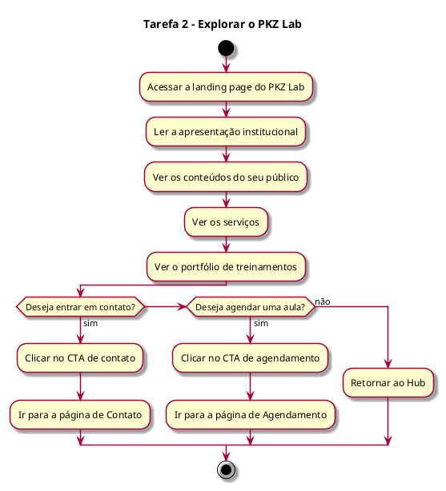
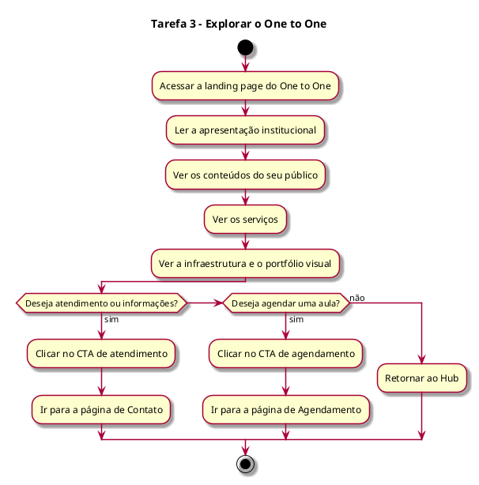
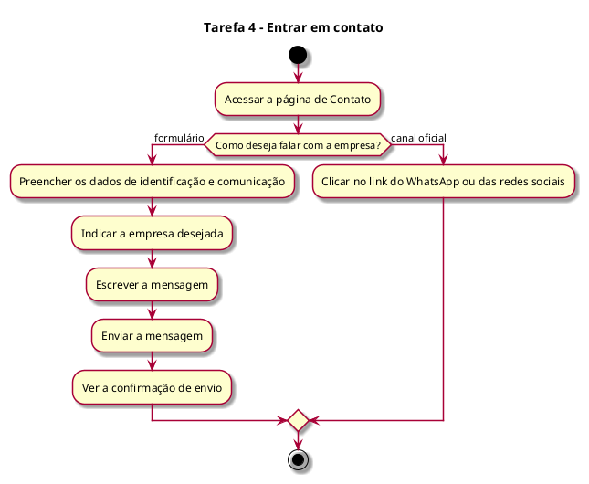
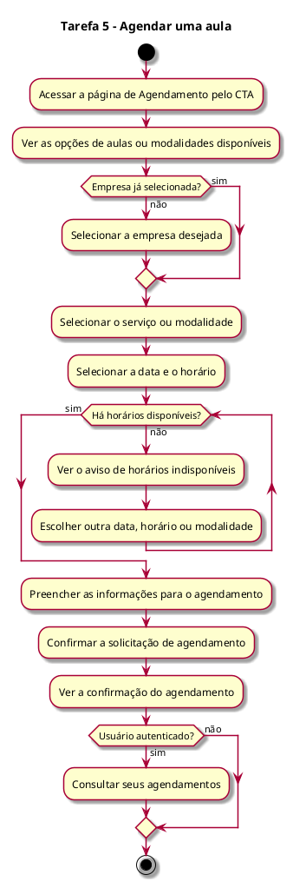
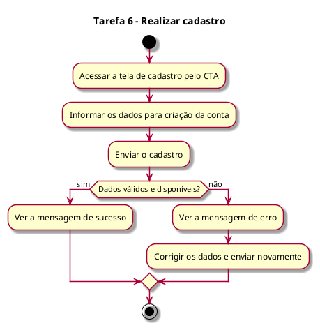
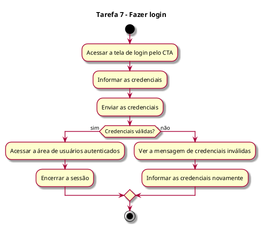

# Análise Hierárquica de Tarefas (AHT) – Portal da Holding Esportiva

## 1. Introdução

Esta AHT descreve as tarefas dos usuários no portal institucional da Holding Esportiva (PKZ Lab e One to One).

Escopo do projeto:

- Somente front-end, com React e Vite (seção 6.1).
- Necessidades que exijam back-end, banco de dados ou autenticação real não serão atendidas no projeto (seção 6.1).
- A página de agendamento de aula faz parte da plataforma (seções 1.2 e 5.1). Na Tarefa 5 é desenvolvida a interface; a verificação real dos horários disponíveis, o registro do agendamento e a consulta dos agendamentos dependem de back-end (seção 6.1).
- As telas de cadastro e login fazem parte da plataforma (seções 4 e 4.1) e devem respeitar as limitações técnicas do projeto (seção 4.2). Por isso, nas Tarefas 6 e 7 é desenvolvida a interface; o funcionamento depende de back-end.
- Áreas restritas com login e autenticação estão fora do escopo (seção 1.2).

Notação:

- 0 = meta principal.
- 1, 2, 3 = tarefas; 1.1, 1.2 = subtarefas.
- Plano = ordem e condições em que o usuário realiza as subtarefas.
- Cada plano é acompanhado do seu diagrama de atividade, escrito em PlantUML.

## 2. Usuários (seção 3.2)

- Visitantes: acessam o site para conhecer as empresas, visualizar seus conteúdos ou encontrar informações de contato.
- Clientes potenciais: ainda não têm relação com as empresas; usam o Hub para identificar qual empresa atende melhor aos seus interesses e depois entrar em contato.
- Atletas Jovens: interessados em treinamento, desenvolvimento esportivo e melhoria de desempenho; acessam principalmente a página do PKZ Lab.
- Atletas Adultos: buscam treinamento personalizado, condicionamento físico ou melhoria de desempenho; conhecem principalmente a proposta do One to One.
- Pais e responsáveis: buscam informações sobre treinamento e desenvolvimento físico para crianças ou adolescentes antes de realizar um contato.

## 3. Hierarquia geral

Meta 0: Conhecer as empresas, entender suas propostas e buscar informações para decidir se deseja entrar em contato (seção 3.2) ou agendar uma aula (seções 1.2 e 5.1).

- 1 – Conhecer a holding no Hub
- 2 – Explorar o PKZ Lab
- 3 – Explorar o One to One
- 4 – Entrar em contato
- 5 – Agendar uma aula
- 6 – Realizar cadastro
- 7 – Fazer login

Plano 0: O usuário começa pelo Hub (Tarefa 1). Depois escolhe qual empresa quer conhecer: PKZ Lab (Tarefa 2) ou One to One (Tarefa 3), podendo voltar ao Hub a qualquer momento. Se quiser falar com a empresa, entra em contato (Tarefa 4). Se quiser marcar uma aula, faz o agendamento (Tarefa 5). Se quiser acessar uma conta, faz o cadastro (Tarefa 6), caso ainda não tenha, e depois o login (Tarefa 7).

Diagrama de atividade do Plano 0:

## 4. Tarefas

### Tarefa 1 – Conhecer a holding no Hub

- 1.1 Acessar o Hub (página inicial)
- 1.2 Ver a Seção Hero (frase de impacto, elementos visuais e botão de ação principal)
- 1.3 Conhecer a holding, sua proposta de atuação e as relações e diferenças entre PKZ Lab e One to One
- 1.4 Navegar pela página (cabeçalho ou scrolling)
- 1.5 Escolher a empresa pelos cards ou ícones direcionadores

Plano 1: O usuário entra no Hub e vê a Seção Hero. Em seguida, navega pela página, pelo cabeçalho ou rolando a tela, para conhecer a holding e suas empresas. Por fim, clica no card da empresa que quer conhecer, indo para a Tarefa 2 ou 3.

Diagrama de atividade do Plano 1:

### Tarefa 2 – Explorar o PKZ Lab

- 2.1 Acessar a landing page do PKZ Lab a partir do Hub
- 2.2 Ler a apresentação institucional
- 2.3 Ver os conteúdos direcionados ao seu público (jovens, atletas de base e Pais/Responsáveis)
- 2.4 Ver os serviços (avaliação física, planejamento de treino, evolução do desempenho, desenvolvimento esportivo e alta performance)
- 2.5 Ver o portfólio de treinamentos (imagens e vídeos)
- 2.6 Clicar no CTA de contato, no CTA de agendamento ou retornar ao Hub

Plano 2: O usuário entra na página do PKZ Lab e lê a apresentação. Depois vê o conteúdo para o seu público, os serviços e o portfólio, na ordem que quiser. No fim, clica no botão de contato (vai para a Tarefa 4), no botão de agendamento (vai para a Tarefa 5) ou volta ao Hub (Tarefa 1).

Diagrama de atividade do Plano 2:

### Tarefa 3 – Explorar o One to One

- 3.1 Acessar a landing page do One to One a partir do Hub
- 3.2 Ler a apresentação institucional
- 3.3 Ver os conteúdos direcionados ao seu público (atletas e não atletas)
- 3.4 Ver os serviços (treinamento personalizado, condicionamento físico e acompanhamento individual)
- 3.5 Ver a infraestrutura e o portfólio visual (imagens e vídeos)
- 3.6 Clicar no CTA de atendimento e informações, no CTA de agendamento ou retornar ao Hub

Plano 3: O usuário entra na página do One to One e lê a apresentação. Depois vê o conteúdo para o seu público, os serviços, a infraestrutura e o portfólio, na ordem que quiser. No fim, clica no botão de atendimento (vai para a Tarefa 4), no botão de agendamento (vai para a Tarefa 5) ou volta ao Hub (Tarefa 1).

Diagrama de atividade do Plano 3:

### Tarefa 4 – Entrar em contato

- 4.1 Acessar a página de Contato
- 4.2 Escolher entre o formulário ou os canais oficiais
- 4.3 Preencher os dados de identificação e comunicação
- 4.4 Indicar a empresa desejada (quando aplicável)
- 4.5 Escrever e enviar a mensagem
- 4.6 Ver a confirmação de envio
- 4.7 Clicar no link ou botão do canal oficial (WhatsApp ou redes sociais)

Plano 4: O usuário entra na página de Contato e escolhe como quer falar com a empresa. Se escolher o formulário, preenche seus dados, indica a empresa, escreve e envia a mensagem, e vê a confirmação de envio. Se preferir um canal oficial, clica no link do WhatsApp ou das redes sociais.

Diagrama de atividade do Plano 4:

### Tarefa 5 – Agendar uma aula

- 5.1 Acessar a página de Agendamento pelo CTA
- 5.2 Ver as opções de aulas ou modalidades disponíveis
- 5.3 Selecionar a empresa desejada (quando aplicável)
- 5.4 Selecionar o serviço ou modalidade
- 5.5 Selecionar a data e o horário disponíveis
- 5.6 Ver o aviso e escolher outra data, horário ou modalidade, se não houver horários disponíveis
- 5.7 Preencher as informações necessárias para o agendamento
- 5.8 Confirmar a solicitação de agendamento
- 5.9 Ver a confirmação do agendamento
- 5.10 Consultar seus agendamentos (usuários autenticados, quando essa funcionalidade estiver disponível)

Plano 5: O usuário abre a página de Agendamento pelo CTA e vê as aulas ou modalidades disponíveis. Se a empresa ainda não estiver definida (quando o acesso não vem da página de uma empresa), escolhe a empresa. Depois escolhe o serviço ou modalidade, a data e o horário. Se não houver horários disponíveis, vê o aviso e escolhe outra data, horário ou modalidade, até encontrar uma opção disponível. Com o horário definido, preenche suas informações, confirma a solicitação e vê a confirmação do agendamento. Se estiver autenticado, pode consultar seus agendamentos, quando essa funcionalidade estiver disponível.

Diagrama de atividade do Plano 5:

Observação sobre a Tarefa 5: é desenvolvida a página de agendamento. A verificação real dos horários disponíveis, o registro do agendamento e a consulta dos agendamentos pelo usuário autenticado exigem back-end, banco de dados e autenticação real, que não serão atendidos no projeto (seção 6.1).

### Tarefa 6 – Realizar cadastro

- 6.1 Acessar a tela de cadastro pelo CTA
- 6.2 Informar os dados para criação da conta
- 6.3 Enviar o cadastro
- 6.4 Corrigir os dados obrigatórios, se inválidos
- 6.5 Informar outros dados, se já estiverem vinculados a outro usuário (quando aplicável)
- 6.6 Ver a mensagem de sucesso

Plano 6: O usuário abre a tela de cadastro, preenche seus dados e envia. Se algum dado estiver errado ou já estiver em uso por outro usuário, ele corrige e envia de novo. Quando o cadastro dá certo, vê a mensagem de sucesso.

Diagrama de atividade do Plano 6:

### Tarefa 7 – Fazer login

- 7.1 Acessar a tela de login pelo CTA
- 7.2 Informar as credenciais
- 7.3 Enviar as credenciais
- 7.4 Ver a mensagem de credenciais inválidas, se houver
- 7.5 Acessar a área de usuários autenticados
- 7.6 Encerrar a sessão

Plano 7: O usuário abre a tela de login, informa suas credenciais e envia. Se estiverem erradas, vê a mensagem de erro e tenta de novo. Se estiverem certas, acessa a área de usuários autenticados e, ao terminar, encerra a sessão.

Diagrama de atividade do Plano 7:

Observação sobre as Tarefas 6 e 7: são desenvolvidas as telas. A criação da conta, a validação dos dados e das credenciais, a sessão e a área restrita exigem back-end e autenticação real, que não serão atendidos no projeto (seções 1.2 e 6.1).

## 5. Rastreabilidade: tarefas × requisitos (seção 5.1)

- Tarefa 1: Apresentação da Holding; Navegação entre as Empresas; Chamadas para Ação.
- Tarefa 2: Página Institucional do PKZ Lab; Navegação entre as Empresas; Conteúdo Visual; Chamadas para Ação.
- Tarefa 3: Página Institucional do One to One; Navegação entre as Empresas; Conteúdo Visual; Chamadas para Ação.
- Tarefa 4: Contato; Chamadas para Ação.
- Tarefa 5: Agendamento de Aula (somente a tela); Chamadas para Ação.
- Tarefa 6: Cadastro de Usuário (somente a tela); Chamadas para Ação.
- Tarefa 7: Login e Acesso (somente a tela); Chamadas para Ação.

## 6. Conclusão

A AHT mostra que a meta principal do usuário é conhecer as empresas da holding e decidir se deseja entrar em contato ou agendar uma aula. O caminho principal é: Hub, escolha da empresa (PKZ Lab ou One to One) e, em seguida, contato (pelo formulário ou pelos canais oficiais) ou agendamento de uma aula. As páginas das empresas permitem retornar ao Hub, e os CTAs levam o usuário ao contato, ao agendamento, ao cadastro ou ao login.

As Tarefas 1 a 4 formam o núcleo do portal (Hub, landing pages e contato) e são desenvolvidas por completo no front-end. A Tarefa 5 é desenvolvida como página de agendamento, pois a verificação real dos horários e o registro dos agendamentos exigem back-end. As Tarefas 6 e 7 são desenvolvidas como telas, pois o funcionamento do cadastro e do login exige back-end e autenticação real, que não serão atendidos no projeto (seções 1.2 e 6.1).
