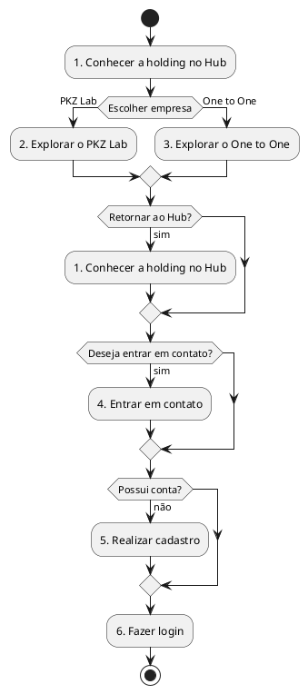
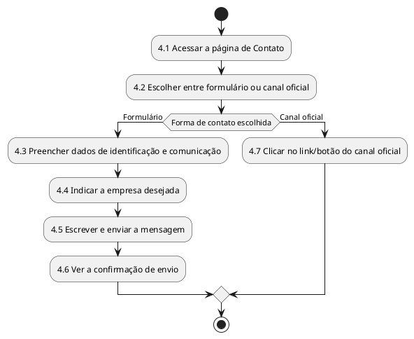
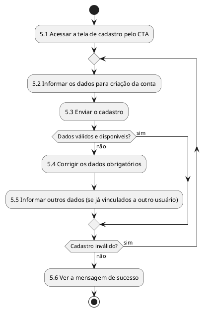
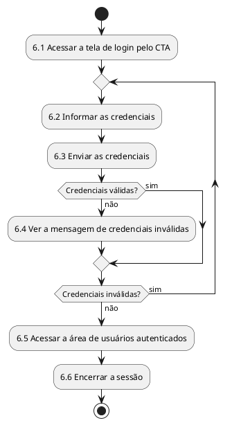

# Análise Hierárquica de Tarefas (AHT) – Portal da Holding Esportiva

## 1. Introdução

Esta AHT descreve as tarefas dos usuários no portal institucional da Holding Esportiva (PKZ Lab e One to One). 

Escopo do projeto:

- Somente front-end, com React e Vite (seção 6.1).
- Necessidades que exijam back-end, banco de dados ou autenticação real não serão atendidas no projeto (seção 6.1).
- As telas de cadastro e login fazem parte da plataforma (seções 4 e 4.1) e devem respeitar as limitações técnicas do projeto (seção 4.2). Por isso, nas Tarefas 5 e 6 é desenvolvida a interface; o funcionamento depende de back-end.
- Áreas restritas com login e autenticação estão fora do escopo (seção 1.2).

Notação:

- 0 = meta principal.
- 1, 2, 3 = tarefas; 1.1, 1.2 = subtarefas.
- Plano = ordem e condições de execução das subtarefas.

Além da notação textual acima, os Planos das Tarefas 4, 5 e 6 e o Plano 0 são representados como diagramas de atividade, gerados com a ferramenta PlantUML (seção 5), conforme orientado no material de Front-end (slides 22 a 26). Notação usada nos diagramas:

- `start` / `stop` = início e fim do fluxo.
- `:Atividade;` = execução de uma subtarefa.
- `if (condição) then (opção) ... else (opção) ... endif` = decisão/bifurcação do fluxo.
- `repeat ... repeat while (condição)` = repetição de subtarefas até que a condição de saída seja atendida.

## 2. Usuários (seção 3.2)

- Visitantes: acessam o site para conhecer as empresas, visualizar seus conteúdos ou encontrar informações de contato.
- Clientes potenciais: ainda não têm relação com as empresas; usam o Hub para identificar qual empresa atende melhor aos seus interesses e depois entrar em contato.
- Atletas Jovens: interessados em treinamento, desenvolvimento esportivo e melhoria de desempenho; acessam principalmente a página do PKZ Lab.
- Atletas Adultos: buscam treinamento personalizado, condicionamento físico ou melhoria de desempenho; conhecem principalmente a proposta do One to One.
- Pais e responsáveis: buscam informações sobre treinamento e desenvolvimento físico para crianças ou adolescentes antes de realizar um contato.

## 3. Hierarquia geral

Meta 0: Conhecer as empresas, entender suas propostas e buscar informações para decidir se deseja entrar em contato (seção 3.2).

- 1 – Conhecer a holding no Hub
- 2 – Explorar o PKZ Lab
- 3 – Explorar o One to One
- 4 – Entrar em contato
- 5 – Realizar cadastro
- 6 – Fazer login

Plano 0: Fazer 1. Depois fazer 2 ou 3, podendo retornar a 1 a partir das páginas das empresas. Para contatar a empresa, fazer 4. Para acessar a conta, fazer 5 (se ainda não tiver conta) e depois 6.

## 4. Tarefas

### Tarefa 1 – Conhecer a holding no Hub

- 1.1 Acessar o Hub (página inicial)
- 1.2 Ver a Seção Hero (frase de impacto, elementos visuais e botão de ação principal)
- 1.3 Conhecer a holding, sua proposta de atuação e as relações e diferenças entre PKZ Lab e One to One
- 1.4 Navegar pela página (cabeçalho ou scrolling)
- 1.5 Escolher a empresa pelos cards ou ícones direcionadores

Plano 1: Fazer 1.1 e 1.2. Fazer 1.3 usando 1.4. Fazer 1.5, que leva à Tarefa 2 ou 3.

### Tarefa 2 – Explorar o PKZ Lab

- 2.1 Acessar a landing page do PKZ Lab a partir do Hub
- 2.2 Ler a apresentação institucional
- 2.3 Ver os conteúdos direcionados ao seu público (jovens, atletas de base e pais/responsáveis)
- 2.4 Ver os serviços (avaliação física, planejamento de treino, evolução do desempenho, desenvolvimento esportivo e alta performance)
- 2.5 Ver o portfólio de treinamentos (imagens e vídeos)
- 2.6 Clicar no CTA de contato ou retornar ao Hub

Plano 2: Fazer 2.1 e 2.2. Fazer 2.3 a 2.5 em qualquer ordem. Em 2.6, o CTA leva à Tarefa 4 e o retorno leva à Tarefa 1.

### Tarefa 3 – Explorar o One to One

- 3.1 Acessar a landing page do One to One a partir do Hub
- 3.2 Ler a apresentação institucional
- 3.3 Ver os conteúdos direcionados ao seu público (atletas e não atletas)
- 3.4 Ver os serviços (treinamento personalizado, condicionamento físico e acompanhamento individual)
- 3.5 Ver a infraestrutura e o portfólio visual (imagens e vídeos)
- 3.6 Clicar no CTA de atendimento e informações ou retornar ao Hub

Plano 3: Fazer 3.1 e 3.2. Fazer 3.3 a 3.5 em qualquer ordem. Em 3.6, o CTA leva à Tarefa 4 e o retorno leva à Tarefa 1.

### Tarefa 4 – Entrar em contato

- 4.1 Acessar a página de Contato
- 4.2 Escolher entre o formulário ou os canais oficiais
- 4.3 Preencher os dados de identificação e comunicação
- 4.4 Indicar a empresa desejada (quando aplicável)
- 4.5 Escrever e enviar a mensagem
- 4.6 Ver a confirmação de envio
- 4.7 Clicar no link ou botão do canal oficial (WhatsApp ou redes sociais)

Plano 4: Fazer 4.1 e 4.2. Se escolher o formulário, fazer 4.3 a 4.6 em sequência. Se escolher um canal oficial, fazer 4.7.

### Tarefa 5 – Realizar cadastro

- 5.1 Acessar a tela de cadastro pelo CTA
- 5.2 Informar os dados para criação da conta
- 5.3 Enviar o cadastro
- 5.4 Corrigir os dados obrigatórios, se inválidos
- 5.5 Informar outros dados, se já estiverem vinculados a outro usuário (quando aplicável)
- 5.6 Ver a mensagem de sucesso

Plano 5: Fazer 5.1 a 5.3. Se houver erro, fazer 5.4 ou 5.5 e repetir 5.3. Com sucesso, fazer 5.6.

### Tarefa 6 – Fazer login

- 6.1 Acessar a tela de login pelo CTA
- 6.2 Informar as credenciais
- 6.3 Enviar as credenciais
- 6.4 Ver a mensagem de credenciais inválidas, se houver
- 6.5 Acessar a área de usuários autenticados
- 6.6 Encerrar a sessão

Plano 6: Fazer 6.1 a 6.3. Se as credenciais forem inválidas, fazer 6.4 e repetir 6.2 e 6.3. Se válidas, fazer 6.5 e, ao terminar, 6.6.

Observação sobre as Tarefas 5 e 6: são desenvolvidas as telas. A criação da conta, a validação dos dados e das credenciais, a sessão e a área restrita exigem back-end e autenticação real, que não serão atendidos no projeto (seções 1.2 e 6.1).

## 5. Diagramas de Atividade (PlantUML)

Conforme os slides 22 a 26 do material de Front-end, a HTA é complementada com diagramas de atividade que ilustram visualmente o fluxo das tarefas descrito nos Planos da seção 4. Os diagramas foram gerados com a extensão **PlantUML** no VS Code (Ctrl+Shift+X → buscar "PlantUML" → instalar), que exige o Java instalado na máquina para renderizar os diagramas a partir do bloco `@startuml ... @enduml`.

### 5.1 Fluxo principal (Plano 0)

Representa o caminho do usuário pelo portal: conhecer a holding no Hub, escolher uma das empresas (podendo retornar ao Hub), buscar contato, e, opcionalmente, cadastro e login.

### 5.2 Tarefa 4 – Entrar em contato

### 5.3 Tarefa 5 – Realizar cadastro

### 5.4 Tarefa 6 – Fazer login

## 6. Rastreabilidade: tarefas × requisitos (seção 5.1)

- Tarefa 1: Apresentação da Holding; Navegação entre as Empresas; Chamadas para Ação.
- Tarefa 2: Página Institucional do PKZ Lab; Navegação entre as Empresas; Conteúdo Visual; Chamadas para Ação.
- Tarefa 3: Página Institucional do One to One; Navegação entre as Empresas; Conteúdo Visual; Chamadas para Ação.
- Tarefa 4: Contato; Chamadas para Ação.
- Tarefa 5: Cadastro de Usuário (somente a tela); Chamadas para Ação.
- Tarefa 6: Login e Acesso (somente a tela); Chamadas para Ação.

## 7. Conclusão

A AHT mostra que a meta principal do usuário é conhecer as empresas da holding e decidir se deseja entrar em contato. O caminho principal é: Hub, escolha da empresa (PKZ Lab ou One to One) e contato, pelo formulário ou pelos canais oficiais. As páginas das empresas permitem retornar ao Hub, e os CTAs levam o usuário ao contato, ao cadastro ou ao login.

As Tarefas 1 a 4 formam o núcleo do portal (Hub, landing pages e contato) e são desenvolvidas por completo no front-end. As Tarefas 5 e 6 são desenvolvidas como telas, pois o funcionamento do cadastro e do login exige back-end e autenticação real, que não serão atendidos no projeto (seções 1.2 e 6.1).

Os diagramas de atividade da seção 5, gerados com PlantUML, complementam a notação textual da AHT ao tornar visíveis as decisões e repetições dos Planos (escolha de empresa, forma de contato, e validação de cadastro/login), facilitando a leitura do fluxo por quem não acompanhou a construção da hierarquia.

